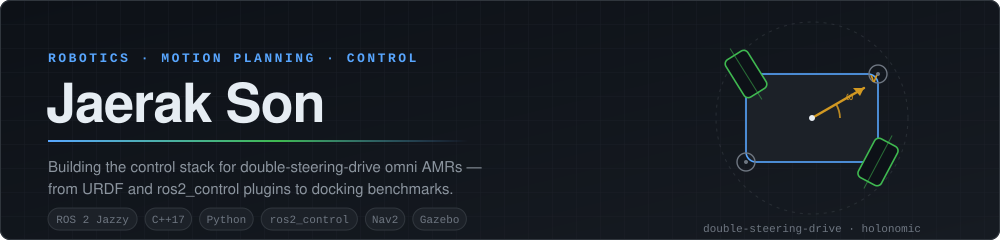
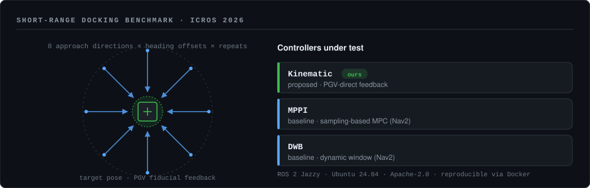
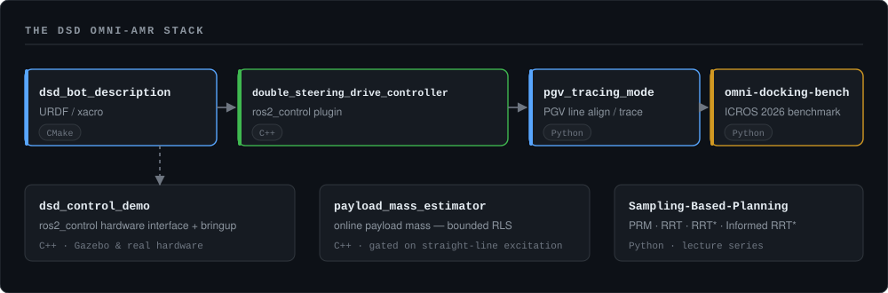

<picture>
  <source media="(prefers-color-scheme: dark)" srcset="assets/hero-dark.svg">
  <source media="(prefers-color-scheme: light)" srcset="assets/hero-light.svg">
  
</picture>

<p align="center">
  
  
  
  
  
  
  
  
</p>

---

## About

I build the **control stack for double-steering-drive (DSD) omnidirectional AMRs** — the kind of
robot that has to slide sideways into a dock and stop within millimetres, repeatably.

That means owning the whole vertical slice: the URDF, the `ros2_control` hardware interface and
controller plugin, the sensor-feedback controller on top of it, and the benchmark that proves the
thing actually works. Most of what I publish here is one layer of that stack.

- 🤖 **Now** — motion planning & control at **PIT-IN (피트인)**
- 📄 **Published** — ICROS 2026, precision docking for DSD omni AMRs
- 🎓 **Teaching** — sampling-based planning lecture series (PRM / RRT / RRT\* / Informed RRT\*)
- 🧰 **Comfortable in** — ROS 2 (Jazzy, Humble), `ros2_control`, Nav2, Gazebo, C++17, Python

---

## Publication

> **Kinematic-based Precision Docking Controller for a Double-Steering-Drive Omni AMR**
> Jaerak Son · **ICROS Annual Conference 2026**
> [`omni-docking-bench`](https://github.com/mach0312/omni-docking-bench) — full reproducibility package (Apache-2.0)

<picture>
  <source media="(prefers-color-scheme: dark)" srcset="assets/docking-dark.svg">
  <source media="(prefers-color-scheme: light)" srcset="assets/docking-light.svg">
  
</picture>

The benchmark is a **3 cm start distance with a 3 mm settling criterion**, swept over an
8-direction × heading-offset × multi-repeat grid, comparing the proposed PGV-direct kinematic
controller against Nav2's MPPI and DWB. Seven metrics per trial, 50 Hz timeseries logs, and a
Docker path so a reviewer can reproduce every number without touching my machine.

---

## The DSD omni-AMR stack

<picture>
  <source media="(prefers-color-scheme: dark)" srcset="assets/stack-dark.svg">
  <source media="(prefers-color-scheme: light)" srcset="assets/stack-light.svg">
  
</picture>

| Repository | What it is | Stack |
|---|---|---|
| **[omni-docking-bench](https://github.com/mach0312/omni-docking-bench)** | Reproducibility package for the ICROS 2026 paper — experiment runner, analyzer, plotter, Docker | Python · ROS 2 Jazzy |
| **[double_steering_drive_controller](https://github.com/mach0312/double_steering_drive_controller)** | `ros2_control` controller plugin for the DSD kinematics | C++17 |
| **[dsd_control_demo](https://github.com/mach0312/dsd_control_demo)** | Hardware interface + bringup for the DSD bot | C++17 · ros2_control |
| **[dsd_bot_description](https://github.com/mach0312/dsd_bot_description)** | URDF / xacro description of the DSD platform | CMake · xacro |
| **[pgv_tracing_mode](https://github.com/mach0312/pgv_tracing_mode)** | Line tracing & pose alignment from a PGV fiducial sensor — holonomic and non-holonomic, with a phase state machine, yaw hysteresis, and a dummy-sensor simulator for closed-loop testing without hardware | Python · ROS 2 Humble |
| **[payload_mass_estimator](https://github.com/mach0312/payload_mass_estimator)** | Online payload mass estimation — bounded RLS on `m·a + b`, rolling-resistance corrected, gated to identifiable straight-line windows and explicit about *why* it rejected a window | C++ · ROS 2 |

---

## Teaching

**[Sampling-Based-Planning_Tutorial](https://github.com/mach0312/Sampling-Based-Planning_Tutorial)** —
Python implementations of PRM, RRT, RRT\*, Informed RRT\* and Connect-RRT, written as lecture
material for **RCI Lab, Kyung Hee University**.

<a href="https://youtube.com/playlist?list=PL5zS4AjTJMs8wwZQyWds0j8TPxq3N_OpD">
  
</a>

---

## Reading list

Repositories I keep forked as references — **upstream work by [RCILab](https://github.com/RCILab)
and [behnamasadi](https://github.com/behnamasadi), not my own code**, kept here because I read and
run them:

`RCI_quadruped_robot_navigation` (Isaac Lab → Gazebo sim-to-sim for Unitree Go2 / B2) ·
`RCI_cscmppi` · `RCI_hybrid_astar_guided_mppi` · `RCI_radiation` · `robotic_notes` · `bench-mr`

---

<details>
<summary><b>Why this profile has no stats cards (and how to add them back)</b></summary>

<br>

The usual `github-readme-stats.vercel.app` cards are **not** on this profile because the shared
public instance returns `503 DEPLOYMENT_PAUSED` — it has been rate-limited into the ground by the
sheer number of profiles pointing at it. Same story for `github-profile-trophy` (`402`). An image
that 503s renders as a broken-image icon, which looks worse than having no card at all.

If you want them, deploy your own instance — it takes about five minutes and never goes down on
someone else's schedule:

1. Fork [`anuraghazra/github-readme-stats`](https://github.com/anuraghazra/github-readme-stats).
2. Create a GitHub personal access token with **no scopes** (public data only).
3. Import the fork into [Vercel](https://vercel.com/new), add the token as the `PAT_1`
   environment variable, and deploy.
4. Point the images at your own deployment:

   ```markdown
   
   
   ```

A contribution activity graph
(`github-readme-activity-graph.vercel.app`) does still work, if you want one:

```markdown

```

The figures on this profile are plain SVG files committed under [`assets/`](assets) and rendered by
[`tools/render_assets.py`](tools/render_assets.py), so they cannot break when a third-party service
goes down. Run `python3 tools/render_assets.py` after editing to regenerate both themes.

</details>

---

## Contact

<p align="left">
  <a href="mailto:jr@pitin-ev.com">
    
  </a>
  <a href="https://www.linkedin.com/in/YOUR-LINKEDIN-HANDLE">
    
  </a>
  <a href="https://github.com/mach0312?tab=repositories">
    
  </a>
</p>

<sub>
  
</sub>
